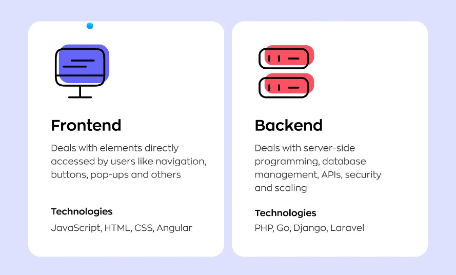
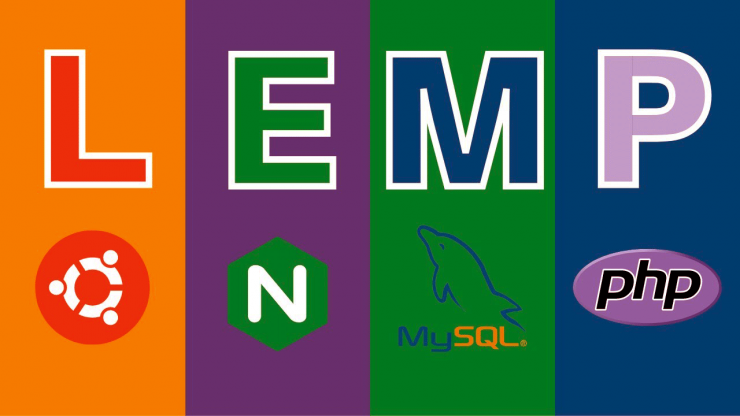
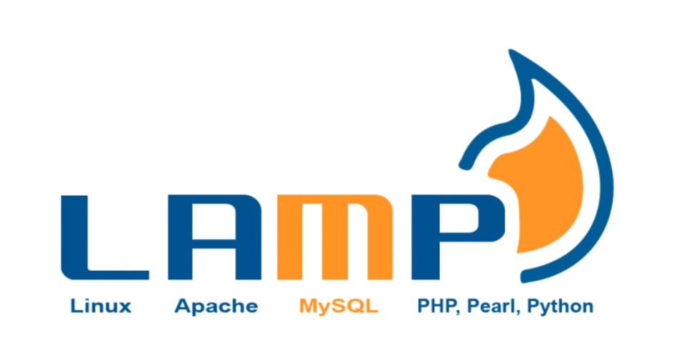
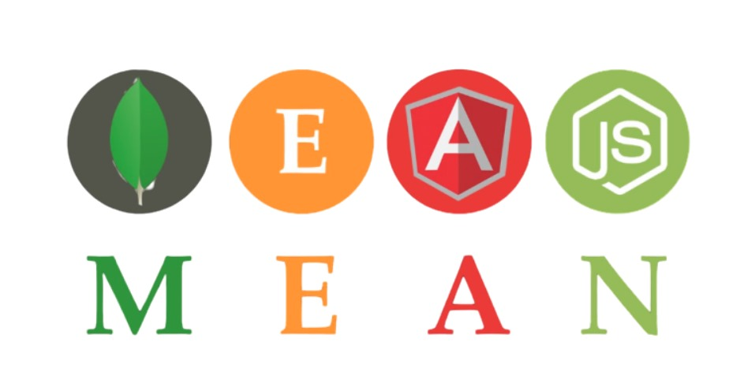
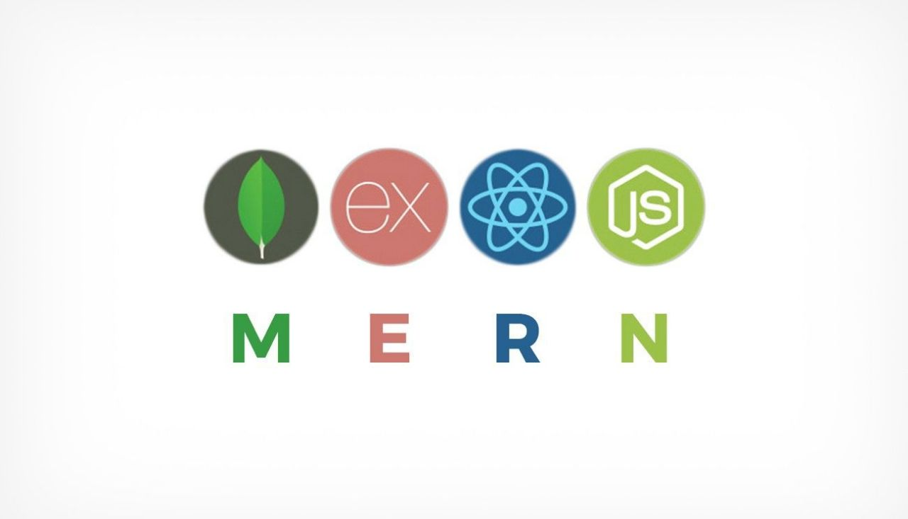
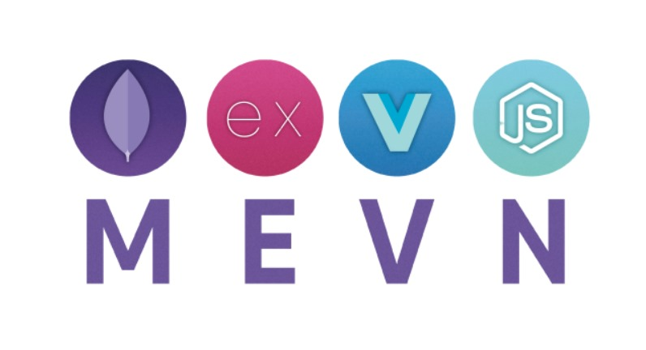

# Introduction

## Table of Contents

- [Deployment](#deployment)
  - [Tujuan Deployment](#tujuan-deployment)
  - [Lingkungan Deployment](#lingkungan-deployment)
  - [Metode Deployment](#metode-deployment)
  - [Alat Deployment](#alat-deployment)
- [Stack Aplikasi](#stack)
  - [LEMP](#lemp-stack)
  - [LAMP](#lamp-stack)
  - [MEAN](#mean-stack)
  - [MERN](#mern-stack)
  - [MEVN](#mevn-stack)

## Deployment

Penyebaran atau deployment adalah tahap akhir dalam `software development life cycle` di mana aplikasi atau software yang telah dikembangkan, dites, disetujui, kemudian dipindahkan atau "disebar" ke lingkungan produksi.

Lingkungan produksi bisa berupa `server`, `komputer user`, atau `infrastruktur cloud` tempat aplikasi akan digunakan oleh end user.

Proses deployment melibatkan berbagai tahapan penting, termasuk persiapan, instalasi, konfigurasi, pengujian, dan optimasi. Tujuan utama proses ini adalah memastikan software berfungsi dengan baik dan aman di lingkungan target.

Jika diumpamakan, deployment seperti mengantarkan pizza yang sudah dimasak dan siap santap ke rumah pelanggan. Penjual tidak hanya perlu memastikan pizza sampai ke tujuan, tetapi juga mengupayakan pizza sampai dalam keadaan hangat dan lezat.

Kesuksesan proses deployment merupakan kunci untuk memastikan produk software dapat digunakan dengan baik oleh end user. Oleh sebab itu, **software engineer harus memiliki pengetahuan yang baik tentang deployment dan mampu melaksanakannya dengan efisien dan efektif**.

### Tujuan Deployment

Berikut beberapa tujuan deployment:
- `Meningkatkan efisiensi`: dengan deployment, perusahaan dapat menghemat waktu dan sumber daya. Software atau aplikasi bisa diinstal, dikonfigurasi, dan dites secara otomatis, sehingga meminimalkan kesalahan dan meningkatkan produktivitas.
- `Mengurangi downtime`: deployment yang berjalan dengan baik akan membantu mengurangi downtime atau waktu tidak aktif. Artinya, software atau aplikasi selalu siap digunakan pengguna sekaligus memperlancar kegiatan operasional perusahaan.
- `Meningkatkan kepuasan pengguna`: deployment juga memastikan software berfungsi dengan baik dan aman. Pada gilirannya, software yang bekerja secara maksimal akan meningkatkan kepuasan pengguna.
- `Mendorong inovasi`:  dengan deployment, perusahaan bisa dengan cepat meluncurkan fitur atau perbaikan baru, sehingga memfasilitasi inovasi dan pertumbuhan.
- `Meningkatkan kontrol dan visibilitas`:  proses deployment berguna untuk memberikan wawasan tentang performa dan stabilitas software/aplikasi, memungkinkan perusahaan membuat keputusan berdasarkan data.
- `Mengurangi risiko adanya kesalahan`: deployment yang dilakukan dengan tepat dapat mengurangi risiko terjadinya kesalahan dan error pada aplikasi di lingkungan produksi.
- `Meningkatkan kualitas produk`: proses deployment melibatkan serangkaian pengujian intensif. Hal ini akan memastikan aplikasi bebas dari bug, sehingga meningkatkan kualitas produk.

### Lingkungan Deployment

Lingkungan deployment adalah tempat dimana software atau aplikasi diterapkan dan dijalankan. Lingkungan deployment dapat berbeda-beda tergantung pada jenis software atau aplikasi yang dibuat. Beberapa contoh lingkungan deployment adalah:

- **Server**: Lingkungan deployment yang menggunakan server sebagai tempat penyimpanan dan pengoperasian software atau aplikasi. Server dapat berupa server lokal (on-premise) atau server jarak jauh (cloud).
- **Desktop**: Lingkungan deployment yang menggunakan komputer desktop sebagai tempat penyimpanan dan pengoperasian software atau aplikasi. Desktop dapat berupa komputer pribadi (personal computer) atau komputer kantor (workstation).
- **Mobile**: Lingkungan deployment yang menggunakan perangkat mobile seperti smartphone atau tablet sebagai tempat penyimpanan dan pengoperasian software atau aplikasi. Mobile dapat berupa perangkat Android, iOS, Windows Phone, atau lainnya.
- **Web**: Lingkungan deployment yang menggunakan browser web sebagai tempat penyimpanan dan pengoperasian software atau aplikasi. Web dapat berupa website statis (static website) atau website dinamis (dynamic website).

### Metode Deployment

Metode deployment adalah cara atau teknik yang digunakan untuk melakukan deployment. Metode deployment dapat berbeda-beda tergantung pada jenis software atau aplikasi yang dibuat. Beberapa contoh metode deployment adalah:
- **Manual**: Metode deployment yang dilakukan secara manual oleh programmer dengan cara mengirimkan file-file dari software atau aplikasi ke lingkungan produksi melalui media transfer seperti flashdisk, email, FTP (File Transfer Protocol), SSH (Secure Shell), dll.
- **Otomatis**: Metode deployment yang dilakukan secara otomatis oleh alat-alat khusus yang dapat mengirimkan file-file dari software atau aplikasi ke lingkungan produksi tanpa campur tangan manusia. Alat-alat ini biasanya disebut sebagai deployment tools atau deployment automation tools.
- **Hybrid**: Metode deployment yang merupakan kombinasi dari metode manual dan otomatis. Metode ini biasanya digunakan untuk software atau aplikasi yang memiliki kompleksitas tinggi atau membutuhkan kustomisasi tertentu.

### Alat Deployment

Alat deployment adalah software atau hardware yang digunakan untuk membantu proses deployment. Alat deployment dapat berbeda-beda tergantung pada jenis software atau aplikasi yang dibuat. Beberapa contoh alat deployment adalah:
- **Git**: Alat deployment yang berfungsi sebagai version control system atau sistem pengelolaan versi dari software atau aplikasi. Git dapat digunakan untuk menyimpan, mengelola, dan mengirimkan file-file dari software atau aplikasi ke lingkungan produksi dengan mudah dan cepat.
- **Ansible**: Ansible adalah alat manajemen konfigurasi dan otomatisasi yang sering digunakan untuk melakukan deployment aplikasi dan konfigurasi infrastruktur secara konsisten dan efisien. Dengan Ansible, kita dapat menentukan keadaan yang diinginkan dari sistem dalam file konfigurasi yang disebut "playbook", dan Ansible akan menjamin bahwa sistem sesuai dengan keadaan yang ditentukan tersebut. Ini membuatnya menjadi alat yang populer untuk deployment aplikasi, manajemen konfigurasi server, dan otomatisasi tugas-tugas operasional lainnya.
- **Jenkins**: Alat deployment yang berfungsi sebagai continuous integration and continuous delivery (CI/CD) tool atau alat integrasi dan pengiriman berkelanjutan dari software atau aplikasi. Jenkins dapat digunakan untuk membangun, menguji, dan menerapkan software atau aplikasi ke lingkungan produksi secara otomatis dan berkala.
- **Docker**: Alat deployment yang berfungsi sebagai container platform atau platform kontainer dari software atau aplikasi. Docker dapat digunakan untuk membuat, menjalankan, dan mendistribusikan software atau aplikasi ke lingkungan produksi dengan cara mengemasnya dalam kontainer-kontainer yang ringan dan portabel.

## Stack

Application stack, atau teknologi stack, adalah kumpulan teknologi, bahasa pemrograman, perangkat lunak, dan alat yang digunakan bersama-sama untuk membangun sebuah aplikasi web atau mobile. Stack ini biasanya terdiri dari beberapa lapisan, termasuk server, frontend, dan backend.

Berikut adalah penjelasan detail tentang komponen-komponen dalam application stack:

1. **Server**: Server adalah komputer yang menyediakan layanan atau sumber daya kepada klien atau pengguna. Dalam konteks web, server adalah tempat di mana aplikasi web di-hosting dan dijalankan. Server juga bertanggung jawab untuk menerima permintaan dari klien dan mengirimkan respons kembali ke klien. Contoh teknologi server termasuk Linux, Windows Server, dan Unix.

2. **Backend**: Backend adalah bagian dari aplikasi yang berjalan di server dan tidak terlihat oleh pengguna. Backend biasanya bertanggung jawab untuk memproses permintaan dari frontend, berinteraksi dengan database, dan menjalankan logika bisnis aplikasi. Backend biasanya dibangun menggunakan bahasa pemrograman seperti PHP, Python, Ruby, Java, atau Node.js, dan framework seperti Express.js, Django, atau Rails.

3. **Database**: Database adalah tempat di mana data aplikasi disimpan dan dikelola. Database bisa berupa SQL (seperti MySQL, PostgreSQL) atau NoSQL (seperti MongoDB, CouchDB). Database bertanggung jawab untuk menyimpan data pengguna, data aplikasi, dan informasi lain yang diperlukan oleh aplikasi.

4. **Frontend**: Frontend adalah bagian dari aplikasi yang terlihat oleh pengguna. Frontend biasanya bertanggung jawab untuk mengambil input dari pengguna, mengirimkan permintaan ke backend, dan menampilkan respons dari backend ke pengguna. Frontend biasanya dibangun menggunakan HTML, CSS, dan JavaScript, dan mungkin juga menggunakan framework atau library seperti React, Angular, atau Vue.js.

5. **Middleware**: Middleware adalah perangkat lunak yang bertindak sebagai jembatan antara sistem operasi atau database dan aplikasi yang berjalan pada server. Middleware memungkinkan komunikasi dan manajemen data antara database dan aplikasi.

6. **DevOps Tools**: Ini adalah alat yang digunakan untuk otomatisasi proses deployment dan manajemen infrastruktur. Contoh dari DevOps tools termasuk Ansible, Docker, Jenkins, Kubernetes, dan Git.

Dengan memahami komponen-komponen ini, pengembang dapat memilih teknologi yang paling sesuai untuk kebutuhan aplikasi mereka dan membangun aplikasi yang efisien dan efektif.

Berikut adalah jenis-jenis dari application stack:

### LEMP Stack

Salah satu stack web server untuk deployment aplikasi adalah LEMP. LEMP adalah singkatan dari Linux, Nginx (baca: engine-ex), MySQL (atau MariaDB), dan PHP (kadang menggunakan Python). LEMP menjadi salah satu stack yang sangat populer. Komponen yang membentuk LEMP ini bersifat open-source dengan dukungan komunitas yang sangat besar.

Komponen dari LEMP:

1. Linux (Operating System): Linux adalah sistem operasi yang digunakan sebagai dasar untuk menjalankan aplikasi web. Linux dipilih karena kestabilannya, keamanannya, dan kemampuannya untuk menjalankan aplikasi web dengan efisien.

2. Nginx (Web Server): Nginx adalah web server yang digunakan untuk mengirimkan konten web kepada pengguna. Nginx terkenal karena kinerjanya yang cepat, skalabilitasnya yang tinggi, dan kemampuannya untuk menangani lalu lintas web yang besar. Nginx juga mendukung fitur-fitur seperti penyeimbangan beban, caching, dan proxy reverse.

3. MySQL (Database Management System): MySQL adalah sistem manajemen basis data yang digunakan untuk menyimpan dan mengelola data aplikasi web. MySQL adalah salah satu database relasional yang paling populer dan memiliki fitur-fitur seperti keamanan, kecepatan, dan skalabilitas yang baik.

4. PHP (Programming Language): PHP adalah bahasa pemrograman yang digunakan untuk mengembangkan aplikasi web dinamis. PHP memungkinkan pengembang untuk membuat halaman web yang dapat berinteraksi dengan pengguna, mengakses basis data, dan melakukan berbagai tugas pemrograman lainnya.

### LAMP Stack

LAMP adalah salah satu stack aplikasi tertua. LAMP adalah singkatan dari Linux, Apache (atau MariaDB), MySQL dan PHP (atau kadang-kadang Perl atau Python). Bedanya LAMP dan LEMP adalah pada penggunaan web servernya. LAMP sendiri cukup dicintai oleh developer karena keandalan dan fleksibilitasnya. Popularitasnya tidak tertandingi, karena beberapa aplikasi web open source populer seperti WordPress dan Drupal didasarkan pada LAMP.

Komponen LAMP:

LAMP adalah singkatan dari Linux, Apache, MySQL, dan PHP. Ini adalah salah satu stack teknologi yang paling populer untuk pengembangan web. Berikut adalah penjelasan singkat tentang setiap komponen dalam LAMP:

1. Linux: adalah sistem operasi open source yang digunakan sebagai dasar untuk menjalankan semua komponen lain dalam stack. Linux dikenal karena kestabilan, keamanan, dan fleksibilitasnya.

2. Apache: adalah web server yang digunakan untuk melayani konten web kepada pengguna. Apache adalah web server yang paling banyak digunakan di dunia dan mendukung berbagai fitur seperti modul yang dapat ditambahkan, autentikasi, dan penanganan SSL.

3. MySQL: adalah sistem manajemen basis data relasional (RDBMS) yang digunakan untuk menyimpan dan mengelola data aplikasi web. MySQL adalah salah satu RDBMS yang paling populer dan mendukung berbagai fitur seperti transaksi, indeks, dan stored procedures.

4. PHP: adalah bahasa pemrograman server-side yang digunakan untuk mengembangkan logika bisnis aplikasi web. PHP adalah bahasa pemrograman yang paling populer untuk pengembangan web dan mendukung berbagai fitur seperti pemrosesan form, akses basis data, dan manajemen sesi.

Dengan menggabungkan keempat komponen ini, LAMP stack memberikan lingkungan pengembangan yang kuat dan fleksibel untuk membangun aplikasi web. Linux menyediakan sistem operasi yang stabil, Apache melayani konten web, MySQL menyimpan dan mengelola data, dan PHP digunakan untuk mengembangkan logika bisnis aplikasi.

LAMP stack sangat populer dalam pengembangan web karena kemudahannya untuk digunakan, dukungan komunitas yang luas, dan karena semua komponennya adalah perangkat lunak open source.

### MEAN Stack

MEAN Stack adalah sebuah teknologi pengembangan perangkat lunak yang terdiri dari empat komponen utama, yaitu:

1. MongoDB: Basis data NoSQL yang menggunakan format dokumen JSON untuk menyimpan data. MongoDB sangat fleksibel dan dapat dengan mudah diintegrasikan dengan aplikasi web.

2. Express.js: Framework web yang berjalan di atas Node.js. Express.js menyediakan berbagai fitur dan alat untuk membangun aplikasi web dengan mudah dan efisien.

3. Angular: Framework pengembangan aplikasi web yang kuat dan populer. Angular memungkinkan developer untuk membuat antarmuka pengguna yang interaktif dan responsif dengan menggunakan HTML, CSS, dan JavaScript.

4. Node.js: Lingkungan runtime JavaScript yang berbasis server. Node.js memungkinkan developer untuk menjalankan JavaScript di sisi server, yang memungkinkan pengembangan aplikasi web yang cepat dan efisien.

Dengan menggunakan MEAN Stack, pengembang dapat membangun aplikasi web yang lengkap, mulai dari sisi server hingga antarmuka pengguna, dengan menggunakan satu bahasa pemrograman yaitu JavaScript. Ini memungkinkan pengembangan yang lebih cepat dan efisien, serta memudahkan pengelolaan kode dan pemeliharaan aplikasi.

### MERN Stack

MERN stack adalah rangkaian teknologi yang digunakan untuk mengembangkan aplikasi web. MERN adalah singkatan dari MongoDB, Express.js, React, dan Node.js. Setiap komponen dalam MERN stack memiliki peran yang berbeda dalam pengembangan aplikasi web.

1. MongoDB: MongoDB adalah basis data NoSQL yang digunakan untuk menyimpan dan mengelola data aplikasi. MongoDB menggunakan format dokumen JSON yang fleksibel dan dapat dengan mudah diintegrasikan dengan aplikasi web.

2. Express.js: Express.js adalah framework web yang berjalan di atas Node.js. Express.js menyediakan alat dan fitur yang memudahkan pengembangan aplikasi web, seperti routing, middleware, dan manajemen permintaan HTTP.

3. React: React adalah library JavaScript yang digunakan untuk membangun antarmuka pengguna (UI) dalam aplikasi web. React menggunakan komponen yang dapat digunakan kembali untuk membangun UI yang dinamis dan responsif.

4. Node.js: Node.js adalah lingkungan runtime JavaScript yang berbasis server. Node.js memungkinkan pengembang untuk menjalankan JavaScript di sisi server, yang memungkinkan pengembangan aplikasi web yang cepat dan efisien.

Dengan menggunakan MERN stack, pengembang dapat membangun aplikasi web yang lengkap, mulai dari sisi server hingga antarmuka pengguna, dengan menggunakan satu bahasa pemrograman yaitu JavaScript. Ini memungkinkan pengembangan yang lebih cepat dan efisien, serta memudahkan pengelolaan kode dan pemeliharaan aplikasi.

MERN stack sangat populer dalam pengembangan aplikasi web karena kombinasi teknologi yang kuat dan fleksibel. MongoDB menyediakan basis data yang skalabel dan mudah digunakan, Express.js menyediakan kerangka kerja yang ringan dan efisien, React memungkinkan pengembangan UI yang interaktif, dan Node.js memungkinkan pengembangan aplikasi web yang cepat dan efisien.

### MEVN Stack

MEVN stack adalah sebuah teknologi stack yang digunakan untuk mengembangkan aplikasi web. MEVN merupakan singkatan dari MongoDB, Express.js, Vue.js, dan Node.js. Setiap komponen dalam MEVN stack memiliki peran yang berbeda dalam pengembangan aplikasi web.

Berikut adalah penjelasan detail tentang setiap komponen dalam MEVN stack:

1. MongoDB: MongoDB adalah basis data NoSQL yang digunakan untuk menyimpan dan mengelola data aplikasi. MongoDB menggunakan format dokumen JSON yang fleksibel dan dapat dengan mudah diintegrasikan dengan aplikasi web. Kelebihan MongoDB adalah kemampuannya dalam menangani data yang bersifat kompleks dan skema yang fleksibel.

2. Express.js: Express.js adalah framework web yang berjalan di atas Node.js. Express.js menyediakan alat dan fitur yang memudahkan pengembangan aplikasi web, seperti routing, middleware, dan manajemen permintaan HTTP. Dengan Express.js, pengembang dapat dengan mudah membuat endpoint API dan mengatur logika bisnis dari aplikasi web.

3. Vue.js: Vue.js adalah library JavaScript yang digunakan untuk membangun antarmuka pengguna (UI) dalam aplikasi web. Vue.js menggunakan pendekatan komponen yang memungkinkan pengembang untuk membagi UI menjadi bagian-bagian yang lebih kecil dan dapat digunakan kembali. Vue.js juga memiliki kemampuan reaktif yang memungkinkan UI berubah secara dinamis sesuai dengan perubahan data.

4. Node.js: Node.js adalah lingkungan runtime JavaScript yang berbasis server. Node.js memungkinkan pengembang untuk menjalankan JavaScript di sisi server, yang memungkinkan pengembangan aplikasi web yang cepat dan efisien. Dengan Node.js, pengembang dapat mengelola permintaan HTTP, mengakses basis data, dan menjalankan logika bisnis dari aplikasi web.

Dengan menggunakan MEVN stack, pengembang dapat membangun aplikasi web yang lengkap, mulai dari sisi server hingga antarmuka pengguna, dengan menggunakan satu bahasa pemrograman yaitu JavaScript. Ini memungkinkan pengembangan yang lebih cepat dan efisien, serta memudahkan pengelolaan kode dan pemeliharaan aplikasi.

MEVN stack sangat populer dalam pengembangan aplikasi web karena kombinasi teknologi yang kuat dan fleksibel. MongoDB menyediakan basis data yang skalabel dan mudah digunakan, Express.js menyediakan kerangka kerja yang ringan dan efisien, Vue.js memungkinkan pengembangan UI yang interaktif, dan Node.js memungkinkan pengembangan aplikasi web yang cepat dan efisien.

MEVN stack adalah sebuah teknologi stack yang digunakan untuk mengembangkan aplikasi web. MEVN merupakan singkatan dari MongoDB, Express.js, Vue.js, dan Node.js. Setiap komponen dalam MEVN stack memiliki peran yang berbeda dalam pengembangan aplikasi web.

Komponen dalam MEVN stack:

1. MongoDB: MongoDB adalah basis data NoSQL yang digunakan untuk menyimpan dan mengelola data aplikasi. MongoDB menggunakan format dokumen JSON yang fleksibel dan dapat dengan mudah diintegrasikan dengan aplikasi web. Kelebihan MongoDB adalah kemampuannya dalam menangani data yang bersifat kompleks dan skema yang fleksibel.

2. Express.js: Express.js adalah framework web yang berjalan di atas Node.js. Express.js menyediakan alat dan fitur yang memudahkan pengembangan aplikasi web, seperti routing, middleware, dan manajemen permintaan HTTP. Dengan Express.js, pengembang dapat dengan mudah membuat endpoint API dan mengatur logika bisnis dari aplikasi web.

3. Vue.js: Vue.js adalah library JavaScript yang digunakan untuk membangun antarmuka pengguna (UI) dalam aplikasi web. Vue.js menggunakan pendekatan komponen yang memungkinkan pengembang untuk membagi UI menjadi bagian-bagian yang lebih kecil dan dapat digunakan kembali. Vue.js juga memiliki kemampuan reaktif yang memungkinkan UI berubah secara dinamis sesuai dengan perubahan data.

4. Node.js: Node.js adalah lingkungan runtime JavaScript yang berbasis server. Node.js memungkinkan pengembang untuk menjalankan JavaScript di sisi server, yang memungkinkan pengembangan aplikasi web yang cepat dan efisien. Dengan Node.js, pengembang dapat mengelola permintaan HTTP, mengakses basis data, dan menjalankan logika bisnis dari aplikasi web.

Dengan menggunakan MEVN stack, pengembang dapat membangun aplikasi web yang lengkap, mulai dari sisi server hingga antarmuka pengguna, dengan menggunakan satu bahasa pemrograman yaitu JavaScript. Ini memungkinkan pengembangan yang lebih cepat dan efisien, serta memudahkan pengelolaan kode dan pemeliharaan aplikasi.

MEVN stack sangat populer dalam pengembangan aplikasi web karena kombinasi teknologi yang kuat dan fleksibel. MongoDB menyediakan basis data yang skalabel dan mudah digunakan, Express.js menyediakan kerangka kerja yang ringan dan efisien, Vue.js memungkinkan pengembangan UI yang interaktif, dan Node.js memungkinkan pengembangan aplikasi web yang cepat dan efisien.

Dengan menggunakan MEVN stack, pengembang dapat membangun aplikasi web yang lengkap, mulai dari sisi server hingga antarmuka pengguna, dengan menggunakan satu bahasa pemrograman yaitu JavaScript. Ini memungkinkan pengembangan yang lebih cepat dan efisien, serta memudahkan pengelolaan kode dan pemeliharaan aplikasi.

MEVN stack sangat populer dalam pengembangan aplikasi web karena kombinasi teknologi yang kuat dan fleksibel. MongoDB menyediakan basis data yang skalabel dan mudah digunakan, Express.js menyediakan kerangka kerja yang ringan dan efisien, Vue.js memungkinkan pengembangan UI yang interaktif, dan Node.js memungkinkan pengembangan aplikasi web yang cepat dan efisien.

Referensi:

- https://www.sepulsa.com/blog/deployment-itu-apa-sih-yuk-simak
- https://revou.co/kosakata/deployment
- https://github.com/arsitektur-jaringan-komputer/lbe-ajk-2022/tree/master/Modul%203
- https://glints.com/id/lowongan/lamp-server-adalah