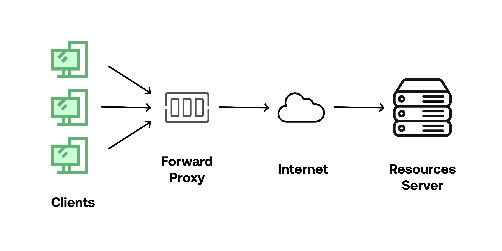
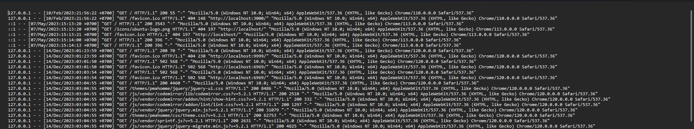
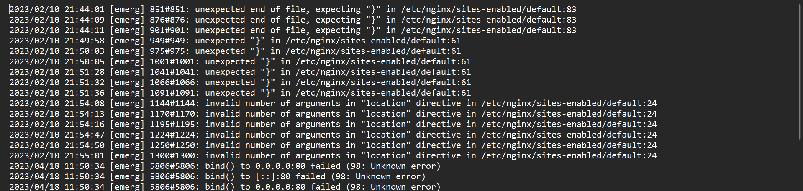
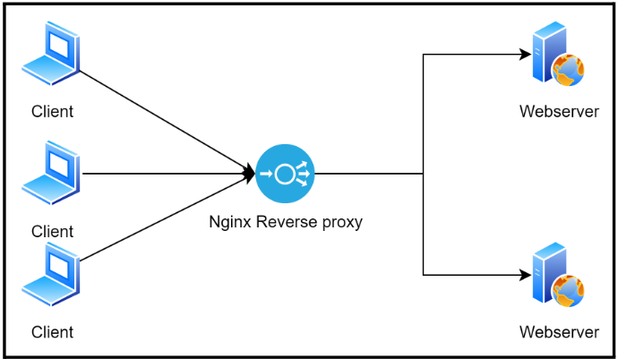

<div align=center>

# Load Testing

</div>

## Table of Contents

1. [Reverse Proxy](#reverse-proxy)
2. [Load Balancing](#load-balancing)
3. [Load Testing dan Monitoring](#apa-itu-process)
4. [Logging](#perintah-terkait-process)
5. [Implementasi](#apa-itu-process)

## Reverse Proxy

Sebelum mengenal Reverse Proxy lebih jauh, perlu diketahui bahwa Reverse Proxy dan Proxy Service, seperti Forward Proxy adalah 2 hal yang berbeda dari cara kerjanya. Sesuai fungsinya masing-masing, `Forward Proxy` berfungsi untuk menyembunyikan identitas client dari server, sedangkan `Reverse Proxy` berfungsi untuk menyembunyikan identitas server dari client.

**A. Forward Proxy**

Secara singkat Forward Proxy adalah service yang disediakan oleh suatu server, dimana server ini akan menjadi perantara bagi kita dan server atau website tujuan. Jadi ketika kita mengakses suatu website yang ada di internet kita akan terlebih dahulu terhubung ke Proxy Server.

Proxy server juga cukup efektif digunakan sebagai sebuah gateway. Nantinya, semua koneksi yang dilakukan akan sesuai dengan setting gateway yang ditetapkan.



Klien tidak langsung terhubung ke server tujuan, sehingga server tujuan tidak mengetahui alamat IP asli klien. Sebaliknya, server tujuan hanya melihat alamat IP dari forward proxy.

**B. Reverse Proxy**

Sedangkan `Reverse Proxy` adalah salah satu jenis server Proxy yang bertanggung jawab dalam meneruskan request client ke server. Reverse Proxy terletak diantara client dan server. Jadi, request yang dilakukan client akan diteruskan oleh Reverse Proxy untuk mencapai ke server. Mudahnya, Reverse Proxy adalah proxy server yang berada di sisi server.

Reverse Proxy biasanya diterapkan pada web server seperti Apache dan Nginx. Selain itu, Reverse Proxy juga digunakan sebagai keamanan agar proses pertukaran request dari client ke server atau sebaliknya berjalan dengan aman.

Reverse Proxy juga bisa melakukan kompresi data. Data yang besar akan dilakukan kompresi sehingga menjadi data dengan ukuran yang lebih kecil. Hal itu dapat membuat pertukaran data berjalan lebih cepat. Reverse Proxy juga memiliki kemampuan untuk menyeimbangkan load atau beban server agar server tidak down (`Load Balancing`).


Klien tidak langsung mengakes server tujuan, sehingga klien tidak mengetahui ip asli dari server akan tetapi hanya ip reverse proxy.

## Load Balancing

Seperti yang sempat disebut sebelumnya, `Load Balancing` adalah teknik untuk mendistribusikan beban kerja di antara dua atau lebih server sehingga tidak ada satu sumber daya yang terbebani lebih dari yang lainnya. Load Balancing juga dapat memastikan bahwa server tidak down atau tidak overload.

Pada load balancing, terdapat beberapa algoritma yang digunakan untuk mendistribusikan beban kerja di antara server-server yang ada. Berikut adalah beberapa algoritma yang digunakan:

**A. Round Robin**

Merupakan algoritma load balancing default yang ada di Nginx, cara kerjanya yaitu jika kita memiliki 3 buah node, maka urutannya adalah dari node pertama, kemudian node kedua, dan ketiga. Setelah node ketiga menerima beban, maka akan diulang kembali dari node ke satu.

**B. Least Connections**

Algoritma ini akan mendistribusikan beban kerja ke server yang memiliki koneksi terendah. Jadi, server yang memiliki koneksi terendah akan mendapatkan beban kerja lebih banyak.

**C. IP Hash**

Algoritma ini akan mendistribusikan beban kerja ke server berdasarkan IP Address dari client. Jadi, client yang memiliki IP Address yang sama akan dihandle oleh server yang sama pula. Mudahnya jika client A mengakses server A, maka client A akan selalu dihandle oleh server A.

**D. Weighted Round Robin**

Algoritma ini akan mendistribusikan beban kerja ke server berdasarkan bobot yang telah ditentukan. Jadi, server yang memiliki bobot lebih besar akan mendapatkan beban kerja lebih banyak.

## Load Testing dan Monitoring

`Load Testing` adalah proses untuk menguji kinerja suatu aplikasi atau website dengan memberikan beban kerja yang tinggi. Tujuan dari load testing adalah untuk mengetahui sejauh mana aplikasi atau website mampu menangani beban kerja yang tinggi.

Ada beberapa tools yang dapat digunakan untuk melakukan load testing dan Monitoring, diantaranya adalah:

**A. Apache JMeter**

Apache JMeter adalah salah satu tools yang digunakan untuk melakukan load testing. JMeter dapat digunakan untuk melakukan load testing pada berbagai protokol seperti HTTP, HTTPS, FTP, JDBC, LDAP, dan masih banyak lagi.

**Instalasi**

- Pada Linux
  ```bash
  sudo apt-get install jmeter
  ```
- Pada Windows
  Download Apache JMeter [disini](https://jmeter.apache.org/download_jmeter.cgi)

**B. Apache Benchmark**

Apache Benchmark adalah tools yang digunakan untuk melakukan load testing pada web server. Apache Benchmark dapat digunakan untuk melakukan load testing pada web server yang menggunakan protokol HTTP dan HTTPS.

**Instalasi**

- Pada Linux
  ```bash
  sudo apt-get install apache2-utils
  ```
- Pada Windows
  Download Apache Benchmark [disini](https://www.apachehaus.com/cgi-bin/download.plx)

**C. HTOP**

HTOP adalah tools yang digunakan untuk melakukan monitoring pada server. HTOP dapat digunakan untuk melihat penggunaan CPU, RAM, dan SWAP pada server.

**Instalasi**

```bash
sudo apt-get install htop
```

## Logging

`Logging` adalah proses untuk mencatat aktivitas yang terjadi pada server. Logging sangat penting untuk dilakukan karena dengan

log file nginx secara default berada di `/var/log/nginx/` dan log file apache secara default berada di `/var/log/apache2/`

Dan pada Nginx log file terbagi menjadi 2 yaitu `access.log` dan `error.log`. `access.log` berisi log dari request yang masuk ke server, sedangkan `error.log` berisi log dari error yang terjadi pada server. Format file log pada nginx adalah dalam format `combined` yang berisi informasi seperti IP Address, waktu request, request, status code, dan ukuran response.

Berikut contoh accces.log pada nginx:


Berikut contoh error.log pada nginx:


## Implementasi

Pada Implementasi ini akan mempraktekkan semua yang telah dijelaskan diatas dan juga akan didokumentasikan lebih jelas.

Untuk implmentasi ini akan menggunakan 3 buah server, yaitu server yang pertama akan berperan sebagai Reverse Proxy dan Load Balancer, sedangkan server yang lain akan berperan sebagai webserver yang akan di load balancing.

Untuk Topologinya adalah sebagai berikut:



Dimana disini kita akan memiliki 2 webserver yang akan di load balancing, dan juga sudah memiliki 1 server yang akan berperan sebagai Reverse Proxy dan Load Balancer.

Ini untuk 2 web server yang sudah tersedia, terlihat bahwa keduanya memiliki ip yang berbeda:


**Langkah-langkah Implementasi**

Pada implementasi ini akan menggunakan Nginx sebagai Reverse Proxy dan Load Balancer, dan juga akan menggunakan Apache Benchmark dan Jmeter untuk melakukan Load Testing.

Step 1 - Instalasi Tools

sebelum menginstal, pastikan untuk melakukan update terlebih dahulu dan jangan lupa pake sudo :)

```bash
sudo apt-get update
sudo apt-get install nginx
sudo apt-get install apache2-utils
sudo apt-get install htop
```

Step 2 - Konfigurasi Nginx sebagai Reverse Proxy dan Load Balancer

Setelah Nginx terinstal, selanjutnya adalah melakukan konfigurasi Nginx sebagai Reverse Proxy dan Load Balancer. Konfigurasi Nginx ini akan dilakukan pada file `/etc/nginx/sites-available`

```nginx
map $http_upgrade $connection_upgrade {
 default upgrade;
 ''      close;
}

upstream backend {
 server 172.31.38.137:9000; # worker1
 server 172.31.19.34:9000; # worker2
}

upstream frontend {
 server 172.31.38.137:3000; # worker1
 server 172.31.19.34:3000; # worker2
}

server {
     listen 80;
     server_name localhost;

     location /api {
         proxy_pass http://backend/api;
         proxy_redirect off;
         proxy_set_header Host $host;
         proxy_set_header X-Real-IP $remote_addr;
         proxy_set_header X-Forwarded-For $proxy_add_x_forwarded_for;
         proxy_set_header X-Forwarded-Proto $scheme;
         proxy_set_header Upgrade $http_upgrade;
         proxy_set_header Connection $connection_upgrade;

         add_header 'Access-Control-Allow-Origin' '*' always;
         add_header 'Access-Control-Allow-Methods' '*' always;
         add_header 'Access-Control-Allow-Headers' '*' always;

         access_log /var/log/nginx/be_access.log;
         error_log /var/log/nginx/be_error.log;
     }

     location / {
         proxy_pass http://frontend;
         proxy_redirect off;
         proxy_set_header Host $host;
         proxy_set_header X-Real-IP $remote_addr;
         proxy_set_header X-Forwarded-For $proxy_add_x_forwarded_for;
         proxy_set_header X-Forwarded-Proto $scheme;
         proxy_set_header Upgrade $http_upgrade;
         proxy_set_header Connection $connection_upgrade;
         proxy_set_header X-Backend-Server $upstream_addr;

         access_log /var/log/nginx/fe_access.log;
         error_log /var/log/nginx/fe_error.log;
     }
}
```

Tenang aja, saya akan jelaskan sedikit tentang konfigurasi diatas.

- `map $http_upgrade $connection_upgrade` adalah konfigurasi untuk mengatur koneksi upgrade pada Nginx.
- `upstream backend` dan `upstream frontend` adalah konfigurasi untuk menentukan kumpulan server mana saja yang akan di load balancing (server pool), dimana disini dibedakan antara backend dan frontend. Dimana yang sudah dijelaskan pada modul sebelumnya bahwa backend di deploy dengan port 9000 pada setiap server dan frontend di deploy dengan port 3000 pada setiap server. dan setiap server harus dituliskan dengan didepannya adalah kata `server` dan diikuti dengan ip server dan port server.
- `listen 80` adalah konfigurasi untuk mendengarkan request yang masuk pada port 80.
- `server_name` adalah konfigurasi untuk menentukan server name yang akan di handle oleh konfigurasi ini (biasanya akan diisi dengan nama domain yang tersedia namun jika tidak ada dapat diisi dengan localhost saja).
- `location` adalah Konfigurasi untuk menangani permintaan yang masuk ke URL sehingga setiap reuest dengan url sesuai dengan location tersebut akan dilakukan pengondisian sesuai dengan konfigurasi yang ada.
- `proxy_pass`: Permintaan akan diteruskan ke grup server yang sesuai dengan server pool yang ada pada upstream.
- `proxy_redirect off;`: Tidak ada pengalihan URL yang akan dilakukan oleh proxy.
- `access_log` dan `error_log` untuk pencatatan log aktivitas dan kesalahan setiap percobaan akses.

Jadi setiap request dengan url `/api` akan diteruskan ke server pool backend, dan setiap request dengan url `/` akan diteruskan ke server pool frontend.

Kalian juga dapat menambahkan parameter tambahan pada upstream seperti `weight` untuk menentukan bobot dari setiap server, sesuai dengan teori yang dijelasakan sebelumnya yaitu `Weighted Round Robin`. Selain itu dapat juga menambahkan algoritma lain seperti `least_conn`, `ip_hash`, dll.

```nginx
# jika menggunakan weight round robin
upstream backend {
 server 172.31.38.137:9000 weight=1; # worker1
 server 172.31.19.34:9000 weight=2; # worker2
}

upstream frontend {
 server 172.31.38.137:3000 weight=1; # worker1
 server 172.31.19.34:3000 weight=2; # worker2
}

# jika menggunkaan least connections
upstream backend {
 least_conn;
 server 172.31.38.137:9000 weight=1; # worker1
 server 172.31.19.34:9000 weight=2; # worker2
}

upstream frontend {
 least_conn;
 server 172.31.38.137:3000; # worker1
 server 172.31.19.34:3000; # worker2
}

# jika menggunakan ip hash

upstream backend {
 ip_hash;
 server 172.31.38.137:9000; # worker1
 server 172.31.19.34:9000; # worker2
}

upstream frontend {
 ip_hash;
 server 172.31.38.137:3000; # worker1
 server 172.31.19.34:3000; # worker2
}
```

namun jika tidak dituliskan maka secara default akan menggunakan algoritma `Round Robin`.

Step 3 - Restart Nginx

Setelah melakukan konfigurasi, selanjutnya adalah melakukan reload pada Nginx agar konfigurasi yang sudah diubah dapat dijalankan.

```bash
sudo service nginx restart
```

jika ada error saat setelah selsai melakukan konfigurasi, maka dapat di cek dengan perintah `sudo nginx -t` untuk mengecek apakah konfigurasi yang sudah diubah sudah benar atau belum.

Step 4 - Load Testing dengan Apache Benchmark

Setelah melakukan konfigurasi, maka reverse proxy yang sekaligus load balancer seharusnya sudah berjalan. Selanjutnya adalah melakukan load testing dengan Apache Benchmark.

```apache
ab -n 1000 -c 100 http://google.com/

# nama domain dapat diganti dengan ip address dari server
# contoh dibawah adalah untuk testing pada server yang telah dikonfigurasi sebelumnya.

ab -n 1000 -c 100 http://54.191.235.169/api
```

Dimana `-n` adalah jumlah total request yang akan dilakukan, dan `-c` adalah jumlah koneksi yang akan dilakukan secara bersamaan.

Bersamaan dengan melakuan load testing, kita juga dapat melakukan monitoring pada server dengan menggunakan `HTOP`.

```bash
htop
```

Step 5 - Cek Log file setelah Load Testing Apache Benchmark

Setelah melakukan load testing, maka kita dapat melihat log file yang ada pada server untuk mengetahui aktivitas yang terjadi pada server.

```bash
cat /var/log/nginx/fe_access.log # log file frontend
cat /var/log/nginx/be_access.log # log file backend
# path log sesuai dengan konfigurasi pada nginx yang sudah dijelaskan sebelumnya.
```

Berikut contoh log file hasil dari load testing dengan Apache Benchmark pada server yang sudah dikonfigurasi sebelumnya:


```bash
cat /var/log/nginx/be_access.log | wc -l
```

yang artinya adalah jumlah request yang masuk pada server backend. karena setiap request akan tercatat menjadi satu baris pada log file.

Terlihat bahwa semua request yaitu 1000 request melewati server reverse proxy terlebih dahulu dan kemudian di load balancing ke 2 server backend, Sehingga terbagi rata antara kedua server backend yaitu masing-masing 500.

Step 6 - Load Testing dengan JMeter

Selain menggunakan Apache Benchmark, kita juga dapat melakukan load testing dengan menggunakan JMeter. JMeter adalah tools yang digunakan untuk melakukan load testing pada berbagai protokol seperti HTTP, HTTPS, FTP, JDBC, LDAP, dan masih banyak lagi.

